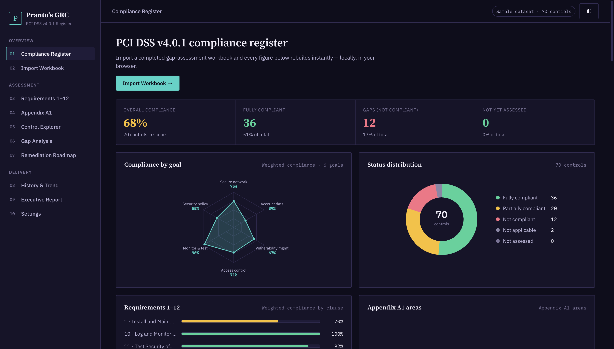
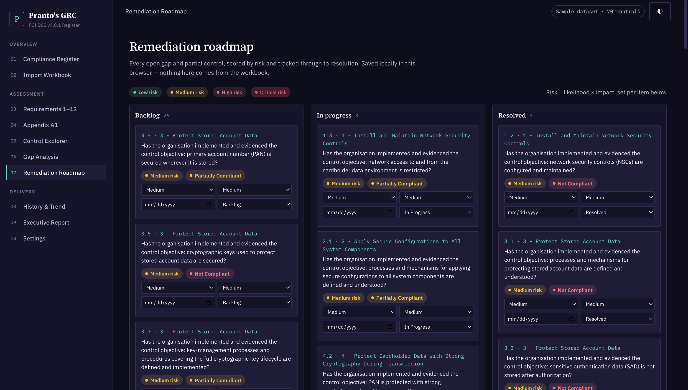
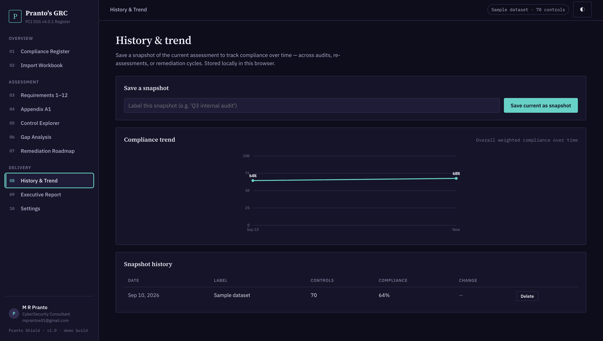

# Pranto Shield — PCI DSS v4.0.1 Compliance Register

A single-page, dependency-light dashboard for tracking a PCI DSS v4.0.1 gap
assessment: import a workbook, and every chart, table, and report rebuilds
instantly, entirely in the browser.

Built as a portfolio piece with **plain HTML, CSS, and JavaScript** — no build
step, no framework, no backend.





## Why PCI DSS is a different shape

Every framework Pranto Shield has modeled so far (ISO 27001, ISO 42001, ISO
27701) is an ISO management-system standard: clauses 4–10 plus one or two
Annexes of controls. PCI DSS isn't a management-system standard at all —
it's a flat, prescriptive set of **12 requirements**, grouped into **6
control objectives ("Goals")**, with no clause 4–10 skeleton underneath.
Reusing the ISO shape here would have been the easy option and the wrong
one, so this build reflects PCI DSS's actual structure instead:

- **Requirements 1–12**, at the control-objective (x.y) level published in
  the standard's own summaries — e.g. Requirement 3 ("Protect Stored
  Account Data") breaks down into 3.1–3.7.
- **Appendix A1**, a short, genuinely distinct annex — "Additional PCI DSS
  Requirements for Multi-Tenant Service Providers" — covering customer
  environment segregation (A1.1) and logging/incident response for those
  environments (A1.2). It only applies to a narrow category of service
  provider, which is why it's kept separate rather than folded into the
  main 12 requirements.
- **6 Goals**, used for the dashboard radar instead of ISO's Annex themes:
  Build and Maintain a Secure Network, Protect Account Data, Maintain a
  Vulnerability Management Program, Implement Strong Access Control
  Measures, Regularly Monitor and Test Networks, Maintain an Information
  Security Policy.

## Features

- **Compliance register (dashboard)** — KPI summary, a 6-point radar across
  PCI's control objectives, a status donut, weighted-compliance bars across
  all 12 requirements, a full compliance matrix, and a "needs attention"
  table — all rendered with hand-rolled SVG, no charting library.
- **Import workbook** — drag-and-drop or browse for a `.xlsx` / `.xls` /
  `.csv` gap-assessment file. Headers are matched flexibly against a
  documented expected structure, with a parse log that flags blank
  references, duplicates, and unrecognised compliance values.
- **Requirements 1–12 / Appendix A1** — two views reflecting the standard's
  real structure, each showing requirement, status, owner, priority, and
  notes.
- **Control explorer** — search/filter every requirement and Appendix A1
  control, with CSV export.
- **Gap analysis** — transparent, rule-based findings (weakest
  requirements, unassessed controls, high-priority gaps). No external
  AI/LLM call is made — the logic is all in `js/app.js`.
- **Remediation roadmap** — every open gap becomes a Kanban card (Backlog /
  In Progress / Resolved), scored by likelihood × impact into a Low–Critical
  risk rating, with an assignable due date. Persisted in `localStorage`,
  independent of whatever workbook is currently loaded.
- **History & trend** — save timestamped snapshots of the assessment and
  watch overall compliance move over time on a line chart, with a
  point-to-point delta table — useful for tracking progress between
  quarterly ROC/SAQ cycles.
- **Backup & restore** — export the full local state (dataset + roadmap +
  snapshot history) as one portable JSON file, and restore it later or on
  another machine.
- **Executive report** — a print-ready, one-page compliance summary
  (`window.print()` → Save as PDF).
- **Light / dark theme**, persisted with `localStorage`.

## Getting started

No build tooling required.

```bash
git clone <this-repo>
cd pranto-shield
python3 -m http.server 8080   # or any static file server
# open http://localhost:8080
```

You can also just open `index.html` directly in a browser — the only
network calls are two font/library CDNs (Google Fonts and SheetJS via
cdnjs); everything else, including all data processing, runs locally.

A ready-to-import example file is included at
`sample-data/pci-dss-v4-sample-assessment.csv`, or click **Load sample
assessment** on the Import Workbook screen.

## Project structure

```
index.html            Page shell + all views
css/styles.css         Design system & layout
js/catalog.js          Canonical PCI DSS v4.0.1 Requirements & Appendix A1 control list
js/data.js              Fictional demo dataset used for "Load sample assessment"
js/charts.js            Dependency-free SVG radar/donut/line chart helpers
js/app.js               State, parsing, rendering, roadmap, history, navigation
sample-data/            Downloadable example workbook (CSV)
```

## Workbook format

Pranto Shield looks for a sheet with these columns (flexible header
matching):

| Column | Notes |
|---|---|
| Category | `Core Requirements` or `Appendix A1 Controls` |
| Section | e.g. `3 - Protect Stored Account Data`, `A1.1 - Multi-tenant service providers protect and separate customer environments` |
| Standard Ref | requirement number, e.g. `3.4`, `A1.2.3` |
| Assessment Question | the requirement text |
| Compliance | `Fully Compliant` / `Partially Compliant` / `Not Compliant` / `Not Applicable` |
| Notes, Owner, Priority | optional |

Any catalog control not present in the uploaded file is shown as **Not
Assessed** rather than being dropped — the register always reflects the
full 63-requirement / 7-control PCI DSS v4.0.1 structure. If you're not a
multi-tenant service provider, mark Appendix A1 rows `Not Applicable` in
your workbook.

## What makes this more than a viewer

A gap-assessment dashboard that only ever reflects whatever file is loaded
right now is useful for a single review meeting and not much else. Pranto
Shield adds the two things a security/compliance team actually needs
between assessments:

- a place to **act** on gaps (the roadmap), with risk scoring so the list is
  triaged rather than flat, and
- a way to **prove progress** over time (snapshots + trend), so "we
  improved compliance from 61% to 84% ahead of this year's ROC" is a chart,
  not a claim.

Both are backed by nothing more than `localStorage` and a JSON export, on
purpose — no server, no accounts, no lock-in.

## Notes

- This is an independent portfolio project inspired by the concept of
  browser-based compliance gap-assessment dashboards. It is not affiliated
  with the PCI Security Standards Council, and the bundled sample data is
  entirely fictional.
- Requirement and control titles follow the published PCI DSS v4.0.1
  numbering and short names for reference purposes; assessment question
  text is original wording, not reproduced from the standard.
- This models the defined-approach requirement structure at the
  control-objective (x.y) level. The full standard includes further
  numbered sub-requirements (x.y.z) and both defined- and customized-
  approach testing procedures, which are out of scope for this demo.

## License

MIT — do whatever you like with it.
